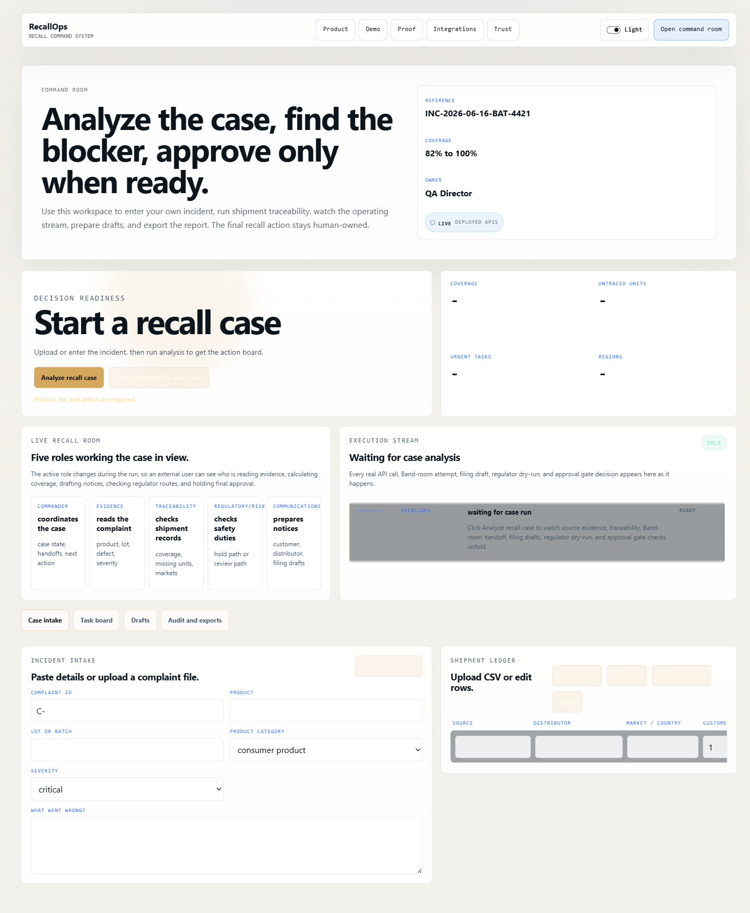
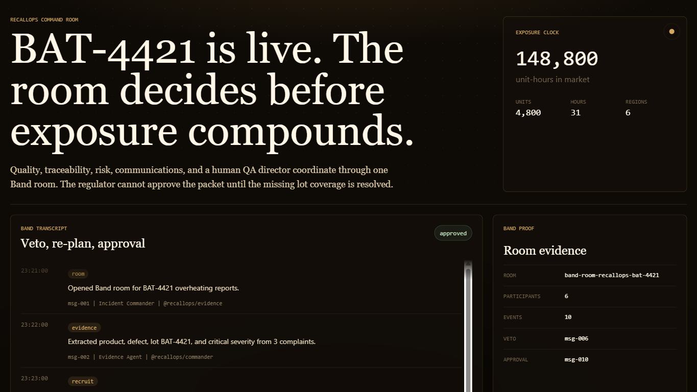

<div align="center">
  <h1>RecallOps</h1>
  <p><strong>Run the recall. Prove the decision.</strong></p>
  <p>RecallOps is a product-recall command system for high-stakes incidents where evidence, traceability, escalation, human approval, and audit proof must stay connected.</p>

  <p>
    <a href="https://recallops.gudman.xyz/"></a>
    <a href="https://youtu.be/15Nj38uSZNI"></a>`r`n    
    <a href="https://recallops.gudman.xyz/slides"></a>
    <a href="LICENSE"></a>
  </p>

  <p>
    <a href="#overview">Overview</a> �
    <a href="#live-demo">Live Demo</a> �
    <a href="#features">Features</a> �
    <a href="#how-it-works">How It Works</a> �
    <a href="#tech-stack">Tech Stack</a> �
    <a href="#run-locally">Run Locally</a> �
    <a href="#license">License</a>
  </p>
</div>



## For Judges

- Track: **Track 3: Regulated & High-Stakes Workflows**
- Demo video: https://youtu.be/15Nj38uSZNI
- Live app: https://recallops.gudman.xyz/
- Command room: https://recallops.gudman.xyz/app
- Proof packet: https://recallops.gudman.xyz/proof
- Slide deck: https://recallops.gudman.xyz/slides

Best test path:

1. Open the command room.
2. Upload an incomplete shipment CSV.
3. Confirm RecallOps blocks approval because traceability is incomplete.
4. Upload the recovered shipment data.
5. Rerun the analysis and inspect the audit packet.

## Overview

When a company discovers that a product may be unsafe, the recall team has to answer urgent questions quickly:

- What product and lot are affected?
- How many units were shipped?
- Where did the units go?
- Can every shipment be traced?
- What notices and filings are needed?
- Who is allowed to approve the recall?
- How can the decision be verified later?

RecallOps brings those answers into one command room. It turns complaint evidence, shipment records, traceability checks, regulatory review, communications, ERP-ready actions, and human approval into a source-linked decision chain.

The core principle is simple: agents help gather, calculate, challenge, draft, and verify, but the final recall decision remains owned by a named human approver.

## Live Demo

- Live application: https://recallops.gudman.xyz/
- Interactive command room: https://recallops.gudman.xyz/app
- BAT-4421 replay: https://recallops.gudman.xyz/demo/bat-4421
- Proof explorer: https://recallops.gudman.xyz/proof
- Slide deck: https://recallops.gudman.xyz/slides
- Demo video: https://youtu.be/15Nj38uSZNI

Recommended demo path:

1. Open the live application.
2. Create or run a recall case.
3. Upload complaint evidence and shipment records.
4. Analyze the recall case.
5. Confirm that incomplete traceability blocks approval.
6. Add the recovered shipment file and rerun analysis.
7. Review the human approval gate.
8. Open the audit packet and proof exports.

## Hackathon Track Fit

RecallOps is built for **Track 3: Regulated & High-Stakes Workflows**.

It fits this track because product recalls require review, traceability, escalation, careful decision-making, and provable human accountability. The system is not a general chatbot or a simple internal task board. It is designed around a regulated workflow where missing evidence must block action and every important step must be auditable.

## Features

| Area               | What RecallOps does                                                                                           |
| ------------------ | ------------------------------------------------------------------------------------------------------------- |
| Case intake        | Accepts complaint details and shipment CSV data.                                                              |
| Source evidence    | Extracts product, lot, defect, severity, shipment totals, regions, and missing records.                       |
| Traceability       | Calculates shipment coverage and identifies untraced units.                                                   |
| Decision readiness | Blocks approval when required traceability or evidence is incomplete.                                         |
| Agent command room | Shows structured specialist-agent work across evidence, traceability, risk, communications, and coordination. |
| Human approval     | Keeps final recall authorization with a named human recall owner.                                             |
| Notice preparation | Drafts customer, distributor, regulator, and quarantine communications.                                       |
| ERP actions        | Prepares SAP and Oracle dry-run payloads while keeping live writes gated.                                     |
| Proof packet       | Produces source hashes, run hashes, receipts, proof exports, and verification data.                           |

## How It Works

```text
Complaint evidence + shipment CSV
              |
              v
Source evidence engine
- parses incident facts
- calculates shipment coverage
- identifies missing records
- creates source digest
              |
              v
Recall command room
- Commander coordinates the case
- Evidence extracts source-backed facts
- Traceability checks shipment coverage
- Regulatory/Risk raises or clears blockers
- Communications prepares notices
              |
              v
Decision control
- shows current blockers
- prevents unsafe approval
- prepares human review scope
              |
              v
Human approval
- named recall owner reviews the case
- approval receipt is sealed
              |
              v
Audit packet
- source evidence
- room events
- filing drafts
- ERP dry-run payloads
- approval receipt
- final digest
```

## Product Model

RecallOps uses a clear authority model:

- **Five specialist agents:** Commander, Evidence, Traceability, Regulatory/Risk, and Communications.
- **One accountable human:** QA Director or Recall Owner.

The agents do not secretly approve a recall. They assemble evidence, expose gaps, prepare actions, and show whether the case is ready. The human approver owns the final decision.

## Screenshots

### Command room


## For Judges

- Track: **Track 3: Regulated & High-Stakes Workflows**
- Demo video: https://youtu.be/15Nj38uSZNI
- Live app: https://recallops.gudman.xyz/
- Command room: https://recallops.gudman.xyz/app
- Proof packet: https://recallops.gudman.xyz/proof
- Slide deck: https://recallops.gudman.xyz/slides

Best test path:

1. Open the command room.
2. Upload an incomplete shipment CSV.
3. Confirm RecallOps blocks approval because traceability is incomplete.
4. Upload the recovered shipment data.
5. Rerun the analysis and inspect the audit packet.

### Existing demo cover



## Tech Stack

| Layer                 | Technology                                                                             |
| --------------------- | -------------------------------------------------------------------------------------- |
| Frontend              | Next.js, React, TypeScript                                                             |
| Backend               | FastAPI, Python                                                                        |
| Agent coordination    | Band room integration and deterministic fallback proof                                 |
| Evidence engine       | CSV parsing, complaint parsing, traceability math, jurisdiction rules                  |
| Proof model           | SHA-256 source digests, run hashes, receipts, audit packet exports                     |
| Integrations          | SAP dry-run payloads, Oracle dry-run payloads, regulator filing drafts                 |
| Optional AI providers | Featherless AI and AI/ML API, with deterministic parsing as the public source of truth |
| Deployment            | VPS, nginx, systemd                                                                    |

## Key Routes and APIs

| Method | Route                      | Purpose                                  |
| ------ | -------------------------- | ---------------------------------------- |
| `GET`  | `/`                        | Product landing page                     |
| `GET`  | `/app`                     | Main command room workspace              |
| `GET`  | `/demo/bat-4421`           | Guided BAT-4421 replay                   |
| `GET`  | `/proof`                   | Audit packet and verification explorer   |
| `GET`  | `/integrations`            | Integration status and boundaries        |
| `GET`  | `/security`                | Security and trust boundaries            |
| `GET`  | `/docs`                    | Developer and API documentation          |
| `POST` | `/api/source-evidence`     | Analyze complaint and shipment evidence  |
| `POST` | `/api/recall-room/run`     | Run source-bound recall room workflow    |
| `POST` | `/api/filing-pack`         | Generate regulator filing drafts         |
| `POST` | `/api/esignature-approval` | Seal human approval receipt              |
| `POST` | `/api/enterprise-sync`     | Prepare ERP dry-run or gated live action |
| `GET`  | `/api/verify`              | Verify deterministic proof digest        |

## Project Structure

```text
recallops/
  recallops/
    api.py                 FastAPI routes and proof bundle assembly
    source_evidence.py     Complaint and shipment parser, citations, coverage math
    recall_room.py         Source-packet-to-room narrative and Band binding
    filing_pack.py         Multi-jurisdiction filing draft generation
    regulatory.py          Regulator dispatch dry-run and live-gate layer
    esignature.py          Human sign-off receipt hashing and verification
    enterprise.py          SAP and Oracle dry-run/live-write gates
  web/
    app/                   Next.js application routes and UI surfaces
    public/                Public web assets
  scripts/                 Band proof capture and support scripts
  tests/                   Backend tests
  docs/                    Proof fixtures and README screenshots
```

## Run Locally

### Backend

```powershell
uv sync --extra dev
.venv\Scripts\uvicorn.exe recallops.api:app --host 127.0.0.1 --port 8098
```

### Frontend

```powershell
cd web
npm install
npm run dev -- --port 3068
```

Then open:

```text
http://127.0.0.1:3068
```

## Example API Request

```bash
curl -X POST https://recallops.gudman.xyz/api/source-evidence \
  -H "content-type: application/json" \
  -d '{
    "complaint_text":"C-KET-9001 | product: Smart kettle | lot: KET-9001 | defect: Battery overheating during normal use | severity: critical",
    "shipment_csv":"source,distributor,region,customers,units,status\nshipment-ledger.csv,NorthLine Distribution,United States,40,800,traced\nkestrel-distributor.csv,Kestrel Retail Group,European Union,20,200,missing"
  }'
```

## Verification Commands

```powershell
.venv\Scripts\python.exe -m pytest
.venv\Scripts\python.exe -m ruff format recallops tests scripts
.venv\Scripts\python.exe -m ruff check --fix recallops tests scripts
cd web; npm run typecheck
cd web; npm run build
```

## Truth Boundaries

RecallOps is intentionally explicit about what is live, captured, deterministic, dry-run, gated, or simulated.

- Public SAP and Oracle paths prepare dry-run payloads unless a real tenant and admin authorization are configured.
- Public regulator dispatch is a draft or dry-run unless real submission gates are configured and authorized.
- Band room proof may use captured reference data when a fresh provider run is unavailable.
- Optional partner-AI calls are not the source of truth. Deterministic parsing and proof receipts remain verifiable.
- The approval receipt is attributable audit evidence, not a claim that the product is certified for 21 CFR Part 11.

## Submission Assets

- Demo video: https://youtu.be/15Nj38uSZNI
- Slide deck: https://recallops.gudman.xyz/slides
- Live app: https://recallops.gudman.xyz/
- GitHub repository: https://github.com/Ridwannurudeen/recallops

## License

RecallOps is released under the MIT License. See [LICENSE](LICENSE).

## Contact

Project repository: https://github.com/Ridwannurudeen/recallops

Live application: https://recallops.gudman.xyz/
